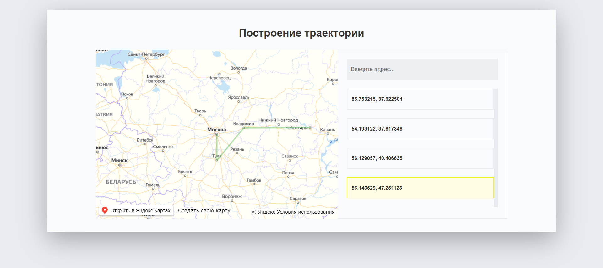
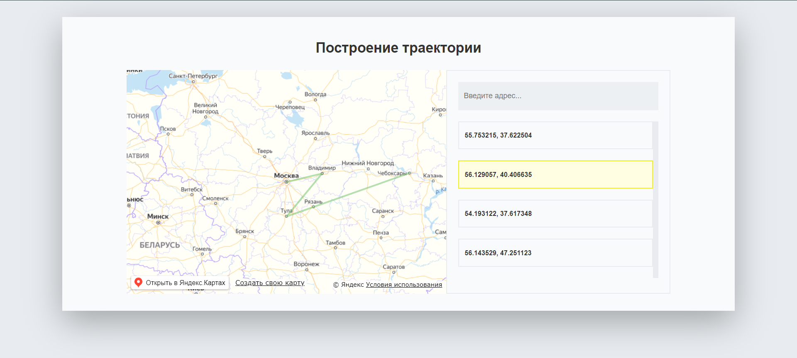

# Построение траектории в Яндекс.Картах

#### Пользователь вводит адреса, из которых формируется список координат. На карте отрисовывается траектория по адресам из списка.

- - - -

#### У пользователя есть возможность перемещать координаты списка, траектория после перемещения перерисовавывается в соответствии с новым порядком списка 

